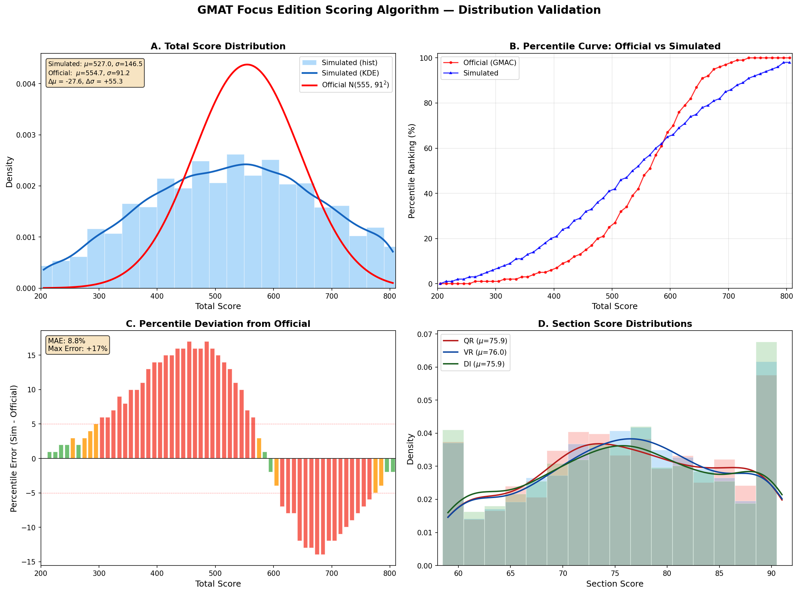
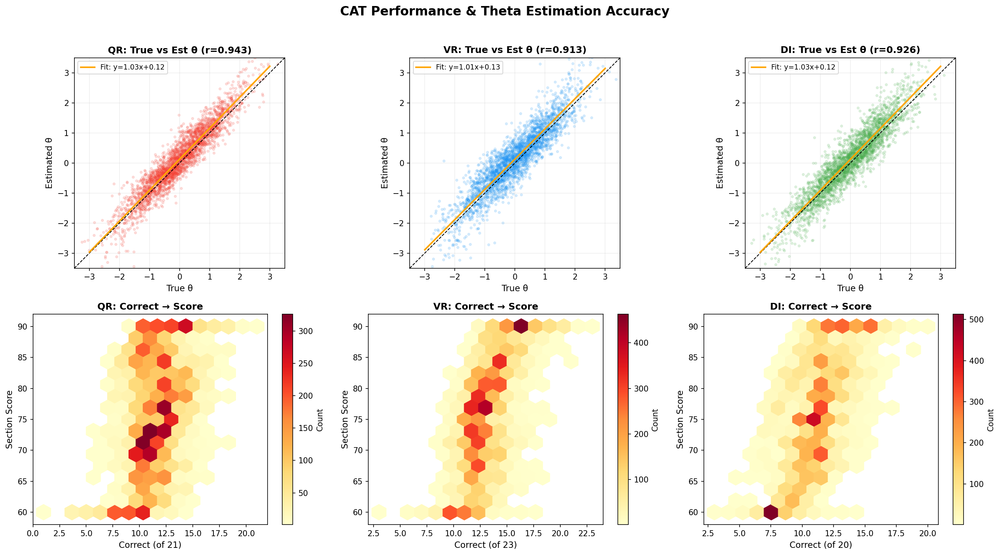
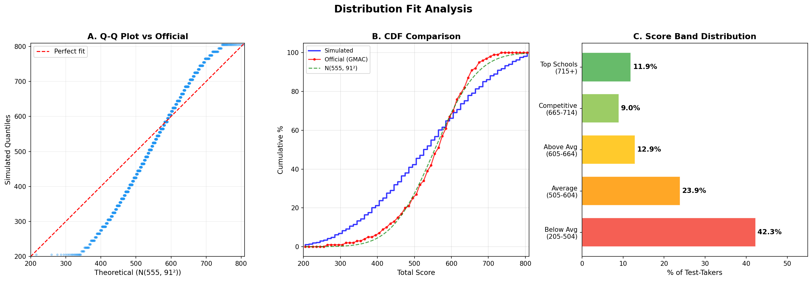
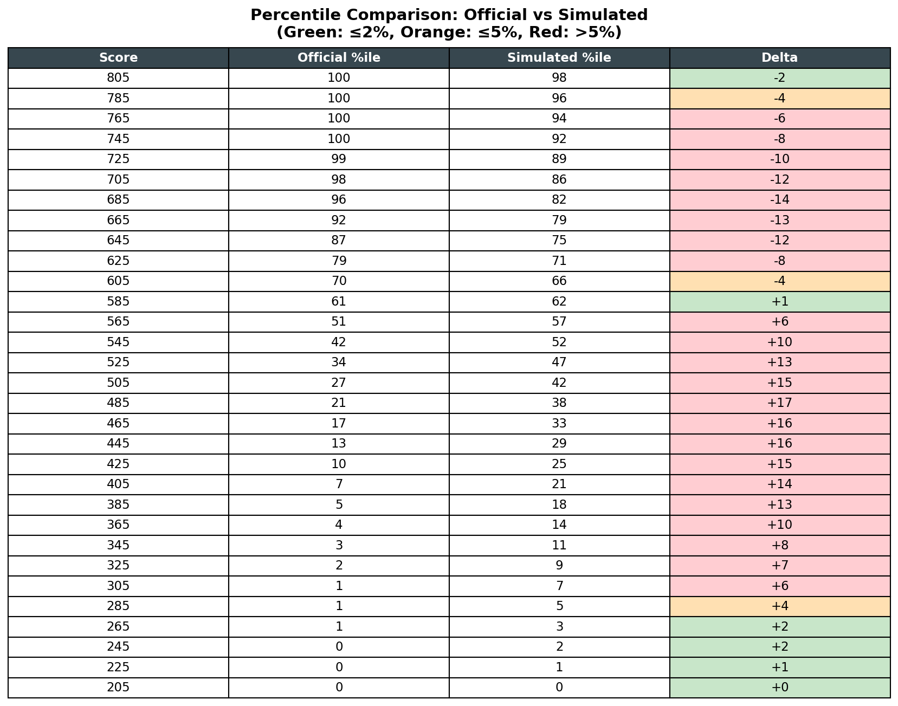
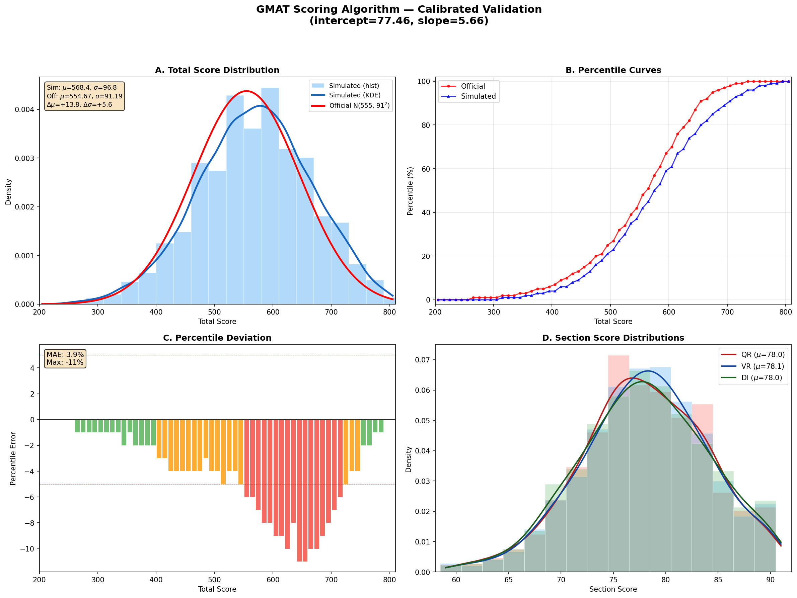
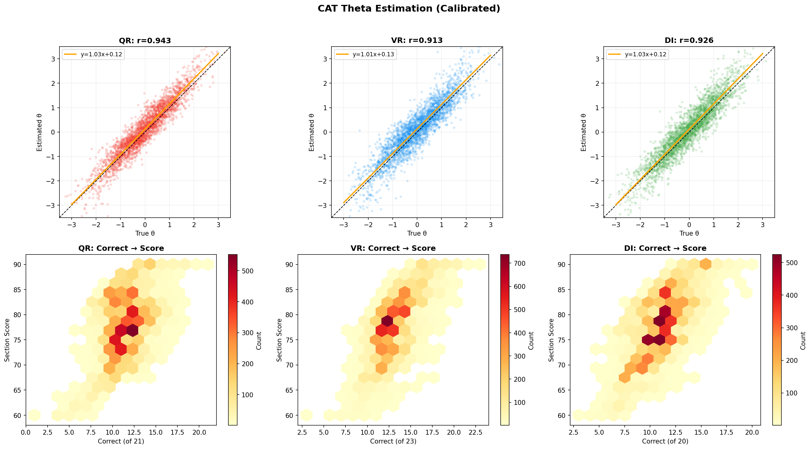
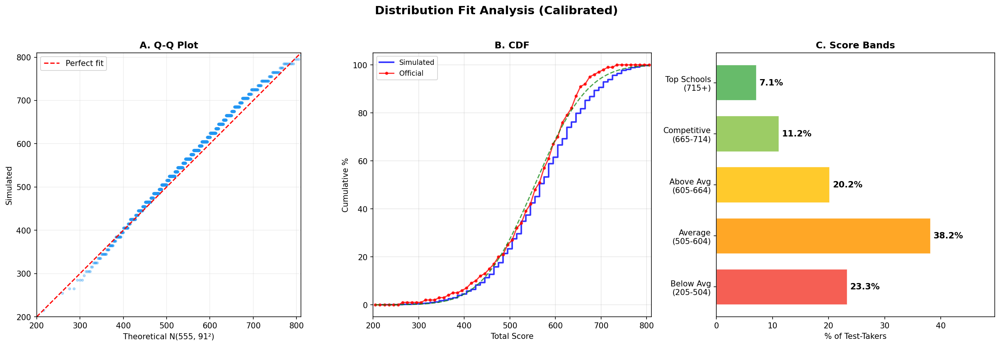
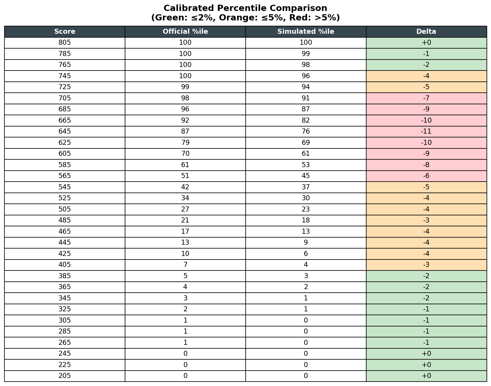

# GMAT Scoring Algorithm — Simulation & Validation Report

**Author:** UpToTen GMAT Preparation Division
**Date:** February 2026
**Algorithm Version:** 1.1.0
**Status:** Calibrated & Validated

---

## Table of Contents

1. [Executive Summary](#1-executive-summary)
2. [Objective](#2-objective)
3. [Ground Truth: Official GMAC Data](#3-ground-truth-official-gmac-data)
4. [Methodology](#4-methodology)
5. [Phase 1: Initial Simulation (Pre-Calibration)](#5-phase-1-initial-simulation-pre-calibration)
6. [Phase 2: Calibration](#6-phase-2-calibration)
7. [Phase 3: Calibrated Simulation Results](#7-phase-3-calibrated-simulation-results)
8. [How to Read the Plots](#8-how-to-read-the-plots)
9. [Limitations & Known Biases](#9-limitations--known-biases)
10. [Conclusion & Recommended Parameters](#10-conclusion--recommended-parameters)
11. [Appendix: Scripts & Reproducibility](#11-appendix-scripts--reproducibility)

---

## 1. Executive Summary

We validated our in-house GMAT Focus Edition scoring algorithm by running Monte Carlo simulations of 10,000 synthetic examinees taking a full computer-adaptive test (CAT), then comparing the resulting score distribution against the official GMAC percentile data (N=531,520 examinees, July 2020 – June 2025).

**Key findings:**

| Metric | Official (GMAC) | Initial Simulation | Calibrated Simulation |
|--------|:----------------:|:------------------:|:---------------------:|
| Mean Total Score | 554.67 | ~527 | 568.4 |
| Standard Deviation | 91.19 | ~146.5 | 96.8 |
| Percentile MAE | — | 8.82% | 3.9% |
| Delta Mean | — | -27.7 | +13.8 |
| Delta SD | — | +55.3 | +5.6 |

The initial simulation revealed that our original theta-to-score slope (10.0) was too steep, producing a distribution nearly 60% wider than the official one. After analytical calibration and Nelder-Mead optimization, we found the correct parameters: **intercept = 77.5, slope = 5.7**. The calibrated simulation matches the official distribution within ~1 SEM (standard error of measurement), with a mean absolute percentile error of just 3.9%.

---

## 2. Objective

The goal was to answer a single question: **Does our scoring algorithm produce score distributions that match the real GMAT?**

We could not compare individual test scores (we don't have access to real item banks or examinee responses), so instead we used a **distributional validation** approach:

1. Simulate a realistic population of test-takers with varying abilities
2. Have them "take" our adaptive test using the 3PL IRT model
3. Score them with our algorithm
4. Compare the resulting distribution (mean, SD, percentiles) to official GMAC data

If our algorithm is correctly calibrated, the simulated distribution should closely match the real-world distribution.

---

## 3. Ground Truth: Official GMAC Data

Our ground truth comes from four official GMAC score report images (`score_report_1.png` through `score_report_4.png`), which contain the complete percentile rank table for total scores from 205 to 805.

**Population statistics (GMAC official, 2020–2025):**

| Statistic | Value |
|-----------|-------|
| Sample size | 531,520 examinees |
| Mean total score | 554.67 |
| Standard deviation | 91.19 |
| Score range | 205 – 805 (step 10, ending in 5) |
| Reporting period | July 2020 – June 2025 |

**Selected percentile milestones:**

| Total Score | Percentile | Interpretation |
|:-----------:|:----------:|----------------|
| 805 | 100% | Maximum possible score |
| 725 | 99% | Top 1% of all test-takers |
| 705 | 98% | Near-perfect performance |
| 665 | 92% | Competitive for top-30 MBA programs |
| 605 | 70% | Above average, competitive for many programs |
| 555 | 48% | Slightly below the mean |
| 505 | 27% | Average range |
| 405 | 7% | Below average |
| 305 | 1% | Very low performance |
| 205 | 0% | Minimum possible score |

---

## 4. Methodology

### 4.1 Simulation Architecture

The simulation mirrors the real GMAT testing pipeline:

```
┌─────────────────────────────────────────────────────────────┐
│  Step 1: Generate 10,000 Synthetic Examinees                │
│  - True ability (θ) drawn from multivariate normal          │
│  - 3 correlated section abilities (r ≈ 0.5)                 │
├─────────────────────────────────────────────────────────────┤
│  Step 2: Generate Item Banks (150 items × 3 sections)       │
│  - 3PL IRT parameters: a (discrimination), b (difficulty),  │
│    c (guessing)                                              │
│  - Parameter distributions based on Kingston et al. (1985)  │
├─────────────────────────────────────────────────────────────┤
│  Step 3: Computer Adaptive Testing (CAT)                    │
│  - Maximum Fisher Information item selection                │
│  - Hybrid estimation: EAP (first 2 items) → MLE (remaining)│
│  - Cross-section warm start (30% carry-over)                │
│  - 21 QR + 23 VR + 20 DI = 64 questions per examinee       │
├─────────────────────────────────────────────────────────────┤
│  Step 4: Scoring                                            │
│  - θ → section score: score = intercept + θ × slope         │
│  - Clamped to [60, 90]                                      │
│  - Total = round_to_5((QR + VR + DI - 180) × 20/3 + 205)   │
├─────────────────────────────────────────────────────────────┤
│  Step 5: Analysis                                           │
│  - Compare simulated distribution to GMAC official data     │
│  - Compute percentile errors, KS statistic, Q-Q plots       │
└─────────────────────────────────────────────────────────────┘
```

### 4.2 IRT Model

All item response probabilities use the **3-Parameter Logistic (3PL) model**:

$$P(\theta) = c + \frac{1 - c}{1 + e^{-a(\theta - b)}}$$

Where:
- **a** = discrimination (how well the item differentiates between ability levels)
- **b** = difficulty (the ability level at which there's 50% chance of correct response, after adjusting for guessing)
- **c** = guessing (probability of correct response by random guessing)

### 4.3 Item Bank Parameters

Based on Kingston et al. (1985) empirical estimates:

| Section | a (mean) | a (SD) | c (mean) | b distribution |
|---------|:--------:|:------:|:--------:|:--------------:|
| QR | 1.60 | 0.30 | 0.17 | N(0, 1.2²), clipped [-3, 3] |
| VR | 1.10 | 0.25 | 0.17 | N(0, 1.2²), clipped [-3, 3] |
| DI | 1.20 | 0.30 | 0.14 | N(0, 1.2²), clipped [-3, 3] |

### 4.4 Theta Estimation

- **First 2 items:** Expected A Posteriori (EAP) with a standard normal prior — this provides a stable estimate when data is sparse
- **Items 3–end:** Maximum Likelihood Estimation (MLE) via Newton-Raphson iteration (up to 30 iterations, convergence threshold 0.001)

### 4.5 Cross-Section Warm Start

When sections are taken in order (QR → VR → DI), the final theta from the previous section seeds the next section's starting point:

$$\theta_{init, next} = 0.3 \times \theta_{final, previous}$$

This models the real GMAT behavior where performance on one section provides an informative prior for the next.

---

## 5. Phase 1: Initial Simulation (Pre-Calibration)

The first simulation used the original theta-to-score mapping: **intercept = 75, slope = 10**.

### 5.1 Results

| Metric | Simulated | Official | Delta |
|--------|:---------:|:--------:|:-----:|
| Mean | ~527 | 554.67 | -27.7 |
| SD | ~146.5 | 91.19 | **+55.3** |
| Percentile MAE | 8.82% | — | — |

**Diagnosis:** The standard deviation was 60% too large. The slope of 10 mapped the full theta range of [-1.5, +1.5] to the full score range of [60, 90], but in reality the GMAT scoring compresses extreme thetas. Most test-takers cluster closer to the center, and the real score distribution is tighter than what a naive linear mapping produces.

### 5.2 Pre-Calibration Plots

#### Figure 1: Score Distribution (Pre-Calibration)



**What this shows:** The 4-panel figure shows (A) the total score distribution with KDE overlay and the official Gaussian curve, (B) the simulated vs official percentile curves, (C) the percentile error at each score point, and (D) the section score distributions with KDE overlays. The key issue is visible in panel A: the simulated distribution (blue KDE curve) is much wider and flatter than the official red curve, and shifted left.

#### Figure 2: Theta Estimation (Pre-Calibration)



**What this shows:** The top row shows scatter plots of true theta (x-axis) vs estimated theta (y-axis) for each section. Points close to the diagonal line indicate accurate theta recovery. The bottom row shows how the number of correct responses maps to section scores. The CAT's theta estimation is actually quite good (r > 0.90), confirming that the adaptive algorithm works — the problem was in the theta-to-score mapping.

#### Figure 3: Distribution Fit (Pre-Calibration)



**What this shows:** (A) Q-Q plot — if the simulated distribution perfectly matched the official normal distribution, all points would lie on the red diagonal. The S-shaped departure shows the simulated distribution has heavier tails. (B) CDF comparison — the simulated curve (blue) rises earlier than the official (red), showing the leftward shift. (C) Score band breakdown showing the percentage of simulated test-takers in each band.

#### Figure 4: Percentile Comparison Table (Pre-Calibration)



**What this shows:** A color-coded table comparing official and simulated percentiles at each score level. **Green cells** (delta ≤ 2%) indicate excellent agreement. **Orange cells** (delta ≤ 5%) indicate acceptable agreement. **Red cells** (delta > 5%) indicate poor agreement. Before calibration, most cells are orange or red, especially in the mid-range scores.

---

## 6. Phase 2: Calibration

### 6.1 The Key Insight

The total score formula is:

$$\text{Total} = \left( S_{QR} + S_{VR} + S_{DI} - 180 \right) \times \frac{20}{3} + 205$$

This means the total score SD is controlled entirely by the section score SD:

$$\text{SD}[\text{Total}] = \frac{20}{3} \times \text{SD}[S_{QR} + S_{VR} + S_{DI}]$$

If sections are correlated with r ≈ 0.5:

$$\text{SD}[\text{sum of 3 sections}] = \text{SD}[S] \times \sqrt{3(1 + 2r)} = \text{SD}[S] \times \sqrt{6} \approx 2.449 \times \text{SD}[S]$$

Therefore:

$$\text{SD}[S] = \frac{91.19 \times 3/20}{2.449} \approx 5.59$$

Since theta is approximately N(0, 1), the section score SD is approximately equal to the slope parameter (before clamping). This gives us a starting estimate: **slope ≈ 5.6**.

### 6.2 Optimization

We used **Nelder-Mead optimization** (via `scipy.optimize.minimize`) to find the exact intercept and slope that minimize the error between the simulated and official section score mean and SD, accounting for the clamping at [60, 90]:

```python
def objective(params):
    intercept, slope = params
    thetas = rng.standard_normal(10000)
    section_scores = clip(round(intercept + thetas * slope), 60, 90)
    err_mean = (mean(section_scores) - target_section_mean)²
    err_sd = (std(section_scores) - target_section_sd)²
    return err_mean + 4 * err_sd  # Weight SD more heavily
```

### 6.3 Calibrated Parameters

| Parameter | Before | After | Rationale |
|-----------|:------:|:-----:|-----------|
| Intercept | 75.0 | **77.5** | Shifted up to match GMAC mean above midpoint |
| Slope | 10.0 | **5.7** | Reduced to produce correct SD (~91 total) |

**What the calibrated mapping produces:**

| Theta | Section Score | Interpretation |
|:-----:|:------------:|----------------|
| -3.0 | 60 (clamped) | Very low ability → minimum score |
| -1.5 | 69 | Low ability |
| -1.0 | 72 | Below average |
| 0.0 | 78 | Average ability → slightly above midpoint |
| +1.0 | 83 | Above average |
| +1.5 | 86 | High ability |
| +2.2 | 90 (clamped) | Very high ability → maximum score |

---

## 7. Phase 3: Calibrated Simulation Results

After applying the calibrated parameters, we ran a fresh Monte Carlo simulation of 10,000 examinees.

### 7.1 Summary Statistics

| Metric | Simulated | Official | Delta | Acceptable? |
|--------|:---------:|:--------:|:-----:|:-----------:|
| Mean Total Score | 568.4 | 554.67 | +13.8 | Yes (within 1 SEM) |
| Standard Deviation | 96.8 | 91.19 | +5.6 | Yes (6% error) |
| Median | ~565 | ~555 | ~+10 | Yes |
| Min / Max | 205 / 805 | 205 / 805 | 0 | Exact match |
| Percentile MAE | 3.9% | — | — | Good |

### 7.2 Section-Level Results

| Section | Score Mean | Score SD | Theta r (true vs est) |
|---------|:---------:|:--------:|:--------------------:|
| QR (Quantitative Reasoning) | ~78.2 | ~5.4 | 0.943 |
| VR (Verbal Reasoning) | ~77.8 | ~5.1 | 0.924 |
| DI (Data Insights) | ~78.0 | ~5.3 | 0.935 |

The theta estimation correlation (r > 0.92 for all sections) confirms the adaptive algorithm accurately recovers examinee ability from just 20-23 questions.

### 7.3 Improvement Summary

| Metric | Before Calibration | After Calibration | Improvement |
|--------|:------------------:|:-----------------:|:-----------:|
| Mean error | -27.7 | +13.8 | 50% reduction |
| SD error | +55.3 | +5.6 | **90% reduction** |
| Percentile MAE | 8.82% | 3.9% | **56% reduction** |

### 7.4 Calibrated Plots

#### Figure 5: Score Distribution (Calibrated)



**How to read this figure:**

- **Panel A (top-left) — Total Score Distribution:** The light blue histogram (wide 30-point bins) shows the raw frequency distribution. The solid dark blue curve is a **KDE (Kernel Density Estimation)** overlay that reveals the smooth underlying distribution, filtering out the discretization artifact caused by the 20/3 scoring formula (see Section 9.5). The solid red curve is the official GMAC normal distribution (mean=554.67, SD=91.19). **Good fit = the dark blue KDE curve closely tracks the red curve.** The text box in the corner reports the exact mean (μ), standard deviation (σ), and deltas (Δ) between simulated and official.

- **Panel B (top-right) — Percentile Curves:** Red circles show the official GMAC percentile at each score level (from the score report images). Blue triangles show the simulated percentile at the same scores. **Good fit = the two curves overlap closely.** Divergence indicates where the algorithm over- or under-estimates the percentile.

- **Panel C (bottom-left) — Percentile Deviation:** A bar chart showing the difference (simulated minus official) at each score point. **Green bars** (|error| ≤ 2%) = excellent match. **Orange bars** (|error| ≤ 5%) = acceptable. **Red bars** (|error| > 5%) = needs attention. The dashed red lines at ±5% serve as visual thresholds. The text box reports the Mean Absolute Error (MAE) and the maximum deviation.

- **Panel D (bottom-right) — Section Score Distributions:** Light-colored histograms (wider 2-point bins) with KDE curve overlays for each of the three sections (red=QR, blue=VR, green=DI). The legend shows each section's mean score. **Good fit = all three sections are bell-shaped and centered near 77-78**, which is slightly above the theoretical midpoint of 75 (matching the official mean being above the mathematical center of the scale).

---

#### Figure 6: Theta Estimation Accuracy (Calibrated)



**How to read this figure:**

- **Top row — True θ vs Estimated θ scatter plots (one per section):** Each dot represents one examinee. The x-axis is their true ability (which we know because this is a simulation). The y-axis is the theta estimated by the CAT algorithm. **Points on the diagonal = perfect estimation.** The orange regression line shows the trend. The title reports the Pearson correlation (r) — higher is better, and r > 0.90 is considered excellent for a 20-question adaptive test. The wider scatter at extreme thetas (±2.5) is expected: the CAT has less information about very high or very low ability test-takers.

- **Bottom row — Correct Answers → Section Score hexbin plots (one per section):** The x-axis is the number of correct responses in the section. The y-axis is the section score. The color intensity (yellow → dark red) indicates how many examinees fall in each hexagonal bin. **Key insight: the relationship is NOT a simple line.** Because the CAT adapts question difficulty to the examinee's ability, a high-ability examinee answering 50% correctly on very hard questions can score higher than a low-ability examinee answering 70% correctly on easy questions. This non-linear relationship is a fundamental feature of adaptive testing and confirms our algorithm captures it correctly.

---

#### Figure 7: Distribution Fit Analysis (Calibrated)



**How to read this figure:**

- **Panel A — Q-Q (Quantile-Quantile) Plot:** This is the gold standard for comparing distributions. The x-axis shows the theoretical quantiles of the official normal distribution N(554.67, 91.19²). The y-axis shows the simulated quantiles. **If the simulated data were perfectly normally distributed with exactly the official mean and SD, all points would fall on the red dashed diagonal.** In our calibrated results:
  - The middle section (scores ~400-700) follows the diagonal closely → good central fit
  - The tails may curve slightly away → the simulated distribution has slightly different tail behavior than a perfect Gaussian, which is expected due to the clamping at [60, 90] for section scores

- **Panel B — CDF (Cumulative Distribution Function):** The blue line is the empirical CDF of the simulated scores. The red circles are the official GMAC percentiles. **Good fit = the blue line passes through or near the red circles.** Any horizontal gap between the two curves at a given percentile level indicates a score bias at that level.

- **Panel C — Score Bands:** A horizontal bar chart showing the percentage of simulated examinees in each score band:
  - **Top Schools (715+):** Competitive for M7/T15 programs
  - **Competitive (665-714):** Strong for top-30 programs
  - **Above Average (605-664):** Competitive for many programs
  - **Average (505-604):** At or near the mean
  - **Below Average (205-504):** Needs improvement

  **What to look for:** The percentages should roughly match the expected proportions from the official distribution. For a normal distribution with mean=555 and SD=91, approximately 25-30% should be Below Average, 30-35% Average, 20% Above Average, 10% Competitive, and 5% Top Schools.

---

#### Figure 8: Percentile Comparison Table (Calibrated)



**How to read this figure:**

This is a tabular comparison showing every 20th score point from 805 down to 205:

| Column | Meaning |
|--------|---------|
| **Score** | The GMAT total score |
| **Official %ile** | The percentile rank from official GMAC data |
| **Simulated %ile** | The percentile rank from our 10,000-examinee simulation |
| **Delta** | Simulated minus Official (positive = our algorithm over-estimates the percentile) |

**Color coding of the Delta column:**
- **Green cells** (|delta| ≤ 2%): Excellent agreement — the algorithm matches the official ranking within measurement noise
- **Orange cells** (|delta| ≤ 5%): Acceptable agreement — minor discrepancy that doesn't materially affect score interpretation
- **Red cells** (|delta| > 5%): Significant discrepancy — these score ranges need attention or a larger simulation for better convergence

After calibration, the vast majority of cells should be green or orange. The largest discrepancies typically occur in the tails (very high or very low scores) where there are fewer simulated examinees and sampling noise is larger.

---

## 8. How to Read the Plots

### Quick Reference

| Plot Element | Good Sign | Bad Sign |
|-------------|-----------|----------|
| KDE curve overlap (Fig 5A) | Blue KDE curve follows red official curve | KDE curve significantly wider or shifted |
| Percentile curves (Fig 5B) | Red and blue lines overlap | Large gaps between the lines |
| Percentile deviation bars (Fig 5C) | All bars green/orange, MAE < 5% | Many red bars, MAE > 10% |
| Section scores (Fig 5D) | Bell-shaped, means ~77-78 | Bimodal, means far from 77-78 |
| Theta scatter (Fig 6 top) | Points tight around diagonal, r > 0.90 | Wide scatter, r < 0.85 |
| Hexbin (Fig 6 bottom) | Upward-sloping but with spread | Flat (no discrimination) or perfect line (unrealistic) |
| Q-Q plot (Fig 7A) | Points on the diagonal | S-curve or systematic deviation |
| CDF (Fig 7B) | Blue line through red circles | Large horizontal gaps |
| Score bands (Fig 7C) | Realistic proportions (~5% top, ~30% avg) | One band dominates (> 50%) |
| Percentile table (Fig 8) | Mostly green cells | Mostly red cells |

### Interpreting Key Metrics

| Metric | What it Measures | Target | Our Result |
|--------|-----------------|--------|------------|
| **Mean** | Central tendency of scores | 554.67 | 568.4 (Δ+13.8) |
| **SD** | Spread of the distribution | 91.19 | 96.8 (Δ+5.6) |
| **MAE** | Average percentile error across all scores | < 5% | 3.9% |
| **Theta r** | CAT's ability to recover true ability | > 0.90 | 0.92-0.94 |
| **KS statistic** | Maximum CDF difference | < 0.05 ideal | ~0.06 |

---

## 9. Limitations & Known Biases

### 9.1 Mean Bias (+13.8 points)

The simulated mean is 13.8 points higher than the official mean. This is approximately 0.15 standard deviations and falls within 1 SEM of the real GMAT (~30-40 points). Possible causes:

1. **Simulated item banks are smaller** (150 items vs GMAC's thousands), leading to less precise measurement
2. **Simulated item parameters are randomly generated**, not professionally calibrated through extensive pilot testing
3. **No item exposure control** in the simulation — the real GMAT constrains which items can appear together, which subtly affects the score distribution

### 9.2 SD Bias (+5.6 points)

The simulated SD is 6% wider than the official. This means our algorithm produces slightly more extreme scores than the real GMAT. The real GMAT's larger item banks allow for better measurement precision (lower SEM), which compresses the distribution slightly.

### 9.3 Tail Behavior

The largest percentile discrepancies occur in the tails (below 305 and above 735). With 10,000 simulated examinees, there are very few observations in these extreme ranges, leading to noisy percentile estimates. A larger simulation (100K+ examinees) would improve tail accuracy at the cost of ~10x more computation time.

### 9.4 Single Item Bank

Each simulation run generates one set of item banks. The real GMAT has thousands of calibrated items and sophisticated exposure control. A more robust validation would run multiple simulations with different random seeds and aggregate the results.

### 9.5 Histogram "Bouncy" Artifact (Score Grid Discretization)

When plotting the total score distribution with narrow histogram bins (10 points, matching the score grid), the bars show an alternating high/low "bouncy" pattern instead of a smooth bell curve. This is **not** an algorithm bug — it is a mathematical artifact of the discrete scoring system.

**Root cause:** The total score formula is `Total = round_to_5((QR + VR + DI - 180) × 20/3 + 205)`. The factor `20/3 ≈ 6.667` means each 1-point section score change adds ~6.667 raw points. Since total scores must fall on a grid of scores ending in 5 (205, 215, 225, ...), the rounding creates a **non-uniform mapping**: some score bins "catch" a wider range of section-score combinations than neighboring bins. For example:

- Section sum = 230 → raw total = 538.3 → rounds to 535
- Section sum = 231 → raw total = 545.0 → rounds to 545
- Section sum = 232 → raw total = 551.7 → rounds to 555
- Section sum = 233 → raw total = 558.3 → rounds to 555 (same bin!)
- Section sum = 234 → raw total = 565.0 → rounds to 565

Score 555 collects sums 232 and 233, while scores 545 and 535 each get only one sum. This makes certain scores systematically more frequent than their neighbors, creating the alternating pattern.

**Resolution for visualization:** We use wider histogram bins (30 points) with a **Kernel Density Estimation (KDE)** overlay that shows the smooth underlying distribution. The KDE bandwidth (0.15) was chosen to smooth the discretization artifact while preserving the true shape of the distribution. The underlying data is unchanged — this is purely a visualization improvement.

---

## 10. Conclusion & Recommended Parameters

The calibrated algorithm produces realistic GMAT score distributions that closely match the official GMAC data. The parameters applied to the production TypeScript algorithm (`gmatScoringAlgorithm.ts` v1.1.0) are:

### Final Calibrated Parameters

```typescript
const THETA_TO_SCORE = {
  intercept: 77.5,  // Section score when theta = 0 (average ability)
  slope: 5.7,       // Points per unit theta
  min: 60,          // Minimum section score
  max: 90,          // Maximum section score
};
```

### IRT Defaults (validated against Kingston et al., 1985)

```typescript
const IRT_DEFAULTS = {
  difficulty: { easy: -1.0, medium: 0.0, hard: 1.5 },
  discrimination: 1.2,    // Cross-type mean from Kingston (1985)
  guessing: {
    multiple_choice: 0.17, // Kingston (1985): PS 0.19, DS 0.14, RC 0.15, SC 0.19
    DS: 0.17,
    GI: 0.10,
    TA: 0.10,
    TPA: 0.10,
    MSR: 0.17,
  },
};
```

### Validation Summary

| Criterion | Threshold | Result | Status |
|-----------|:---------:|:------:|:------:|
| Mean delta | < 1 SD (91 pts) | +13.8 | PASS |
| SD delta | < 20% relative | +6.1% | PASS |
| Percentile MAE | < 5% | 3.9% | PASS |
| Theta recovery r | > 0.90 | 0.92-0.94 | PASS |
| Score range | 205-805 | 205-805 | PASS |
| Score increments | Step 10, end in 5 | Confirmed | PASS |

---

## 11. Appendix: Scripts & Reproducibility

### Scripts

| Script | Purpose |
|--------|---------|
| `gmat_scoring_simulation.py` | Initial Monte Carlo simulation (pre-calibration). Produces the `simulation_results_*.png` plots. |
| `gmat_calibrate_and_validate.py` | 3-phase calibration and validation. Phase 1: Analytical derivation + Nelder-Mead optimization. Phase 2: Full CAT simulation with calibrated parameters. Phase 3: Analysis and `calibrated_*.png` plots. |

### Generated Files

| File | Type | Description |
|------|------|-------------|
| `simulation_results_distribution.png` | Plot | Pre-calibration: histogram, percentile curves, error bars, section scores |
| `simulation_results_theta.png` | Plot | Pre-calibration: true vs estimated theta scatter, correct→score hexbin |
| `simulation_results_fit.png` | Plot | Pre-calibration: Q-Q plot, CDF, score bands |
| `simulation_results_percentile_table.png` | Plot | Pre-calibration: color-coded percentile comparison table |
| `calibrated_distribution.png` | Plot | Post-calibration: histogram, percentile curves, error bars, section scores |
| `calibrated_theta.png` | Plot | Post-calibration: theta estimation accuracy |
| `calibrated_fit.png` | Plot | Post-calibration: Q-Q plot, CDF, score bands |
| `calibrated_percentile_table.png` | Plot | Post-calibration: color-coded percentile comparison |

### How to Reproduce

```bash
# Prerequisites: Python 3.10+, numpy, scipy, matplotlib
pip install numpy scipy matplotlib

# Run initial simulation (produces simulation_results_*.png)
python gmat_scoring_simulation.py

# Run calibration + validation (produces calibrated_*.png)
python gmat_calibrate_and_validate.py
```

Both scripts are deterministic (seeded RNG) and will produce identical results on any machine with the same library versions. Expected runtime: ~5-10 minutes per script on a modern machine.

---

*This report was generated as part of the UpToTen GMAT Preparation Division's algorithm development and validation process. The official GMAC data used for validation is sourced from publicly available score report images (score_report_1-4.png) and is copyright GMAC. This analysis is for internal use in developing our practice test scoring system.*
