# Data Insights Overview

## Data Sets and Types

### Data Sets

A **data set** is an organized collection of data about a specific topic. A data set can be shown with one or more tables, charts, or both.

**Example:**

> One data set might have data about all the employees in a company's human resources division, such as their first names, last names, home addresses, phone numbers, positions, salaries, hiring dates, and full-time or part-time statuses.

A **case** is an individual or thing about which data is collected. Often the same types of data about many cases together form a data set. Then a table or chart can show those types of data for all the cases.

**Example:**

> In the example above, each employee in the human resources department is a case.

A **variable** is any specific type of data collected about a set of cases. For each case in a data set, the variable has a value.

**Example:**

> In the example above, each type of data collected about the employees is a variable: first name is one variable, home address is another variable, phone number is a third variable, and so on. If Zara is an employee in the human resources department, one value of the variable first name is "Zara."

In a simple table, the top row often names the variables. Each column shows one variable's values for all the cases. In a chart, labels usually say which variables are shown.

The value of a **dependent variable** depends on the values of one or more other variables in the data set. An **independent variable** is not dependent.

**Example:**

> In a data set of revenues, expenses, and profits, revenue and expense are independent variables. But profit is a dependent variable because profit is calculated as revenue minus expense. For each case, the value of the variable profit depends on the values of the variable's revenue and expense.

A **data point** gives the value of a specific variable in a specific case. A cell in a table usually stands for a data point.

**Example:**

> In the example above, one data point might be that Zara's position is assistant manager. That is, the data point gives the value "assistant manager" for the variable position in Zara's case.

A **record** is a list of the data points for one case. A row in a table usually shows one record. In a chart, a record might be shown as a point, a line, a bar, or a small shape with a specific position or length.

**Example:**

> In the example above, one record might list Zara's first name, last name, home address, phone number, position, salary, hiring date, and full-time or part-time status.

---

### Qualitative Data

**Qualitative data** is any type of data that doesn't use numbers to stand for a quantity. Statements, words, names, letters, symbols, algebraic expressions, colors, images, sounds, computer files, and web links are all qualitative data. Even data that looks numeric is qualitative if the numbers don't stand for quantities.

**Example:**

> Phone numbers are qualitative data. That's because they don't stand for quantities and aren't used in math—for example, they are generally not summed, multiplied, or averaged.

**Nominal data** is any type of qualitative data that's not ordered in any relevant way. The statistical measures of mean, median, and range don't apply to nominal data because those measures need an ordering that nominal data lacks. But even in a set of nominal data, some values may appear more often than others. So, the statistical measure of mode does apply to nominal data because the mode is simply the value that appears most often.

**Example:**

> In the example above, the first names of the human resource department's employees are nominal data if their alphabetical order doesn't matter in the data set. Suppose three of the employees share the first name "Amy," but no more than two of the employees share any other first name. Then "Amy" is the mode of the first names of the department's employees because it's the first name that appears most often in the data set.

**Ordinal data** is qualitative data ordered in a way that matters in the data set. Because ordinal data is qualitative, its values can't be added, subtracted, multiplied, or divided. So, the statistical measures of mean and range do not apply to ordinal data because they're calculated with those arithmetic operations. However, the statistical measure of median does apply to ordinal data because finding a median only requires putting the values in an order. The statistical measure of mode also applies, just as it does for nominal data.

**Example:**

> In a data set for a weekly schedule of appointments, the weekdays Monday, Tuesday, Wednesday, Thursday, and Friday are ordinal data. These days are in an order that matters to the schedule, but they're not numbers and don't measure quantities. Suppose the data set lists seven appointments: two on Monday, two on Tuesday, and three on Thursday. The fourth appointment is the median in the schedule because three appointments are before it and three are after it. The fourth appointment is on Tuesday, so "Tuesday" is the median value of the variable weekday for the appointments in this data set. "Thursday" is the mode, because more of the appointments are on Thursday than on any other day.

**Binary data** takes only two values, like "true" and "false." Binary data is ordinal if the order of the two values matters, but nominal otherwise. Tables may show binary values with two words like "yes" and "no," or with two letters like "T" and "F," or simply with a check mark or "X" standing for one of the two values, and a blank space standing for the other.

**Example:**

> In the example above of the data set of employees in a human resource department, their employment status is a binary variable with two values: "full time" and "part time." A table might show the employment status data in a column simply titled "Full Time," with a checkmark for each full-time employee and a blank for each part-time employee.

**Partly ordered data** has an order among some cases but not among others. The statistical measure of median does not apply to a set of partly ordered values, though it might apply to a subset whose values are all fully ordered.

**Example:**

> Suppose a family tree shows how people over several generations were related as parents, children, and siblings, but doesn't show when each person was born. This tree lets us partly order the family members by the variable age. For example, suppose the family tree shows that Haruto's children were Honoka and Akari and Honoka's child was Minato. Since we know that all parents are older than their children, we can tell that Haruto was older than Honoka and Akari, and that Honoka was older than Minato. That also means Haruto was older than Minato. But we cannot determine whether Akari is older or younger than her sister Honoka. We can't even deduce with certainty whether Akari is older or younger than her nephew Minato. So, the family tree only partly orders the family members by age.

---

### Quantitative Data

**Quantitative data** is data about quantities measured in numbers. Quantitative values can be added, multiplied, averaged, and so on. The statistical measures of mean, median, mode, range, and standard deviation all apply to quantitative data.

**Example:**

> In the example above of the data set of the employees in the human resource department, the salaries are quantitative data. They're amounts of money shown as numbers.

**Continuous data** - Quantitative data is continuous if it measures something that can be infinitely divided.

**Examples:**

> Temperatures are continuous data. That's because for any two different temperatures, some third temperature is between them—warmer than one and cooler than the other. Likewise, altitudes are continuous data. For any two different altitudes, some third altitude is higher than one and lower than the other.

A set of continuous quantitative values rarely has a mode. Because infinitely many of these values are possible, usually no two of them in a data set are exactly alike.

**Discrete data** - Quantitative data that isn't continuous is discrete.

**Examples:**

> (i) The numbers of students taking different university courses are discrete data, because they're whole numbers. A course normally can't have a fractional number of students.
>
> (ii) As another example, prices in a currency are discrete data, because they can't be divided beyond the currency's smallest denomination. Suppose one price in euros is €3.00, and another is €3.01. No price in euros is larger than the first and smaller than the second, because the currency has no denomination below one euro cent (1/100 of a euro). That means you can't have a price of €3.005, for example. The prices in euros aren't continuous, so they're discrete.

Counted numbers of people, objects, or events are generally discrete data.

---

#### Interval Data

**Interval data** uses a measurement scale whose number zero doesn't stand for a complete absence of the factor measured. So, for interval data, a measurement above zero doesn't show how much greater than nothing the measured quantity is. Because of this, the ratio of two measurements in interval data isn't the ratio of the two measured quantities.

**Examples:**

> (i) Dates given in years are interval data. In different societies' calendars, the year "0" stands for different years. The year 0 in the Gregorian calendar was roughly the year 3760 in the Hebrew calendar, -641 in the Islamic calendar, and -78 in the Indian National calendar. In none of these calendars does 0 stand for the very first year ever. This means, for example, that the ratio of the numbers in the two years 500 CE and 1500 CE in the Gregorian calendar isn't the ratio of two amounts: the year 500 CE isn't 1/3 the amount of the year 1500 CE.
>
> (ii) As another example, temperatures given in degrees Celsius, or Fahrenheit are also interval data. The temperature 0 degrees Celsius is 32 degrees Fahrenheit. In neither temperature scale does 0 degrees mean absolute 0, the complete absence of heat. This means, for example, that the ratio of the numbers in the temperatures 30°F and 60°F isn't the ratio of two amounts of heat. Thus, 60°F isn't twice as hot as 30°F.

In a measurement scale for interval data, each unit stands for the same amount. That is, any two measurements that differ by the same number of units stand for two quantities that differ by the same amount.

**Examples:**

> (i) In the example above of dates given in years, the year 1500 CE was 1000 years after 500 CE, because 1500 − 500 = 1000. Likewise, the year 1600 CE was 1000 years after 600 CE, because 1600 − 600 = 1000. Although you can't divide one year by another to find a real ratio, you can subtract one year from another to find a real-time interval—in this case, 1000 years.
>
> (ii) Likewise, 60°F is the same amount warmer than 40°F as it is cooler than 80°F. A 20°F difference in two measured temperatures always stands for the same real difference in heat between those temperatures.

---

#### Ratio Data

**Ratio data** uses a measurement scale whose number zero stands for the absence of the measured factor. In ratio data, as in interval data, the difference between two measurements stands for the actual difference between the measured amounts. However, in ratio data, unlike interval data, the ratio of two measurements also stands for the actual ratio of the measured amounts.

**Examples:**

> (i) Measured weights are ratio data, whether they're in kilograms or pounds. That's because 0 kilograms stands for a complete absence of weight, as does 0 pounds. So, the ratio of 10 kilograms to 5 kilograms is a ratio of two real weights. Because the ratio of 10 to 5 is 2 to 1, 10 kilograms is twice as heavy as 5 kilograms, and 10 pounds is twice as heavy as 5 pounds.
>
> (ii) As another example, temperatures measured in degrees Kelvin are ratio data. That's because 0°K stands for absolute zero, the complete absence of heat. Thus, 200°K is really twice as hot as 100°K. As explained above, this isn't the case with temperatures measured in degrees Celsius or Fahrenheit, which are interval data.

---

#### Logarithmic Data

**Logarithmic data** uses a measurement scale whose higher values stand for amounts exponentially farther apart. For logarithmic data, as for ratio data, the number zero stands for a complete absence. But in logarithmic data, the higher two measurements a certain number of units apart are, the greater the real difference between the measured amounts is.

**Example:**

> Noise measured in decibels is logarithmic data. Although 0 decibels indicates complete silence, a noise of 30 decibels is 10 times as loud as a noise of 20 decibels, not just 1.5 times as loud. And the real difference in loudness between 40 decibels and 30 decibels is 10 times the real difference in loudness between 30 decibels and 20 decibels, even though the first difference and the second difference are each 10 decibels.

Because the units at higher levels on a logarithmic scale stand for greater amounts of difference, you can't just sum and divide logarithmic data to find a statistical mean. Nor can you subtract one logarithmic measurement from another to find a statistical range. Finding the mean and range require more complex calculations, which you won't have to do on the GMAT.

---

## Data Displays

### Tables

A **table** shows data in rows and columns. In a simple table, the top row shows the names of the variables and is called the **header**. Below the header, usually each row shows one record, each column shows one variable, and each cell shows one data point. Sometimes another row above the header has the table's title or description. Sometimes a column or a few rows within the table are used only to group the records by category. Likewise, a row or a few columns within the table are sometimes used only to group the variables by category. Sometimes a row or column shows totals, averages, or other operations on the values in other rows or columns.

**Example:**

> The table below shows revenues, expenses, and profits for two branches of Village Shoppe for one year. The top row is the header listing the independent variables revenue and expense and the dependent variable profit. In each row, the profit is just the revenue minus the expense.
>
> The table has only four rows of records. These are the third row showing the Mapleton branch's January-June finances, the fourth row showing the Mapleton branch's April-December finances, the sixth row showing the Elmville branch's January-June finances, and the seventh row showing the Elmville branch's April-December finances. The second row "Mapleton branch" serves to group the third and fourth rows together. Likewise, the fifth row "Elmville branch" serves to group the sixth and seventh rows together. The bottom row "Annual grand totals" doesn't show a record, but rather sums the values in the four records for each of the three variables.

| Village Shoppe | Revenue | Expense | Profit |
|---|---|---|---|
| **Mapleton branch** | | | |
| &nbsp;&nbsp;&nbsp;January-June | 125,000 | 40,000 | 85,000 |
| &nbsp;&nbsp;&nbsp;April-December | 90,000 | 35,000 | 55,000 |
| **Elmville branch** | | | |
| &nbsp;&nbsp;&nbsp;January-June | 85,000 | 30,000 | 55,000 |
| &nbsp;&nbsp;&nbsp;April-December | 115,000 | 25,000 | 90,000 |
| **Annual grand totals** | 415,000 | 130,000 | 285,000 |

Sometimes a table's title or description explains the data shown. To understand the data, always study any title or description.

**Example:**

> In the table below, the title says the populations are in thousands. So, to find the total population aged 44 and under, add 63,376 thousand and 86,738 thousand. This gives 150,114 thousand, which is 150,114,000. If you only read the numbers without noticing the title, you'll get the wrong result for the total population aged 44 and under.

**Population by Age Group (in thousands)**

| Age | Population |
|---|---|
| 17 years and under | 63,376 |
| 18–44 years | 86,738 |
| 45–64 years | 43,845 |
| 65 years and over | 24,051 |

---

### Qualitative Charts

Many different types of charts show qualitative data. To understand any type of chart, study its labels. The labels will tell you how to read the chart's various points, lines, shapes, symbols, and colors. Several labels may be together, sometimes inside a rectangle on the chart, to make a **legend**.

---

#### Network Diagrams

A **network diagram** has lines connecting small circles or other shapes. Each small shape is a **node** standing for an individual, and each line stands for a relationship between two individuals. In some network diagrams, the lines are one-way or two-way arrows standing for one-way or two-way relationships.

**Example:**

> In the network diagram below, the lettered nodes stand for six pen pals: Alice, Ben, Cathy, Dave, Ellen, and Frank. The arrows show who got a letter from whom in the past month. Each arrow points from the pen pal who sent the letter to the one who got it. A two-way arrow means both the pen pals got letters from each other. This diagram tells us many facts about the pen pals and their relationships over the past month. For example, it shows who got the most letters (Cathy received three) and who got the fewest (Frank received none).

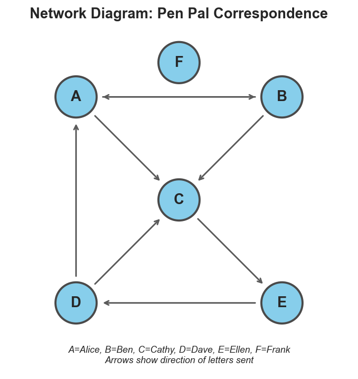

---

#### Tree Diagrams

A **tree diagram** is a type of network diagram that shows partly ordered data like organizational structures, ancestral relationships, or conditional probabilities. In a tree diagram, each relationship is one way.

**Example:**

> Expanding on the example in 1.1.2.E, the tree diagram below shows how all of Haruto's descendants are related. Each line connects a parent above to his or her child below. The diagram shows how Haruto has two children, four grandchildren, and one great-grandchild. From the diagram we can tell that Akari is older than her grandchild Mei, and that Himari and Minato are cousins. However, we can't tell whether Akari, Mei, or Himari is older than Minato.

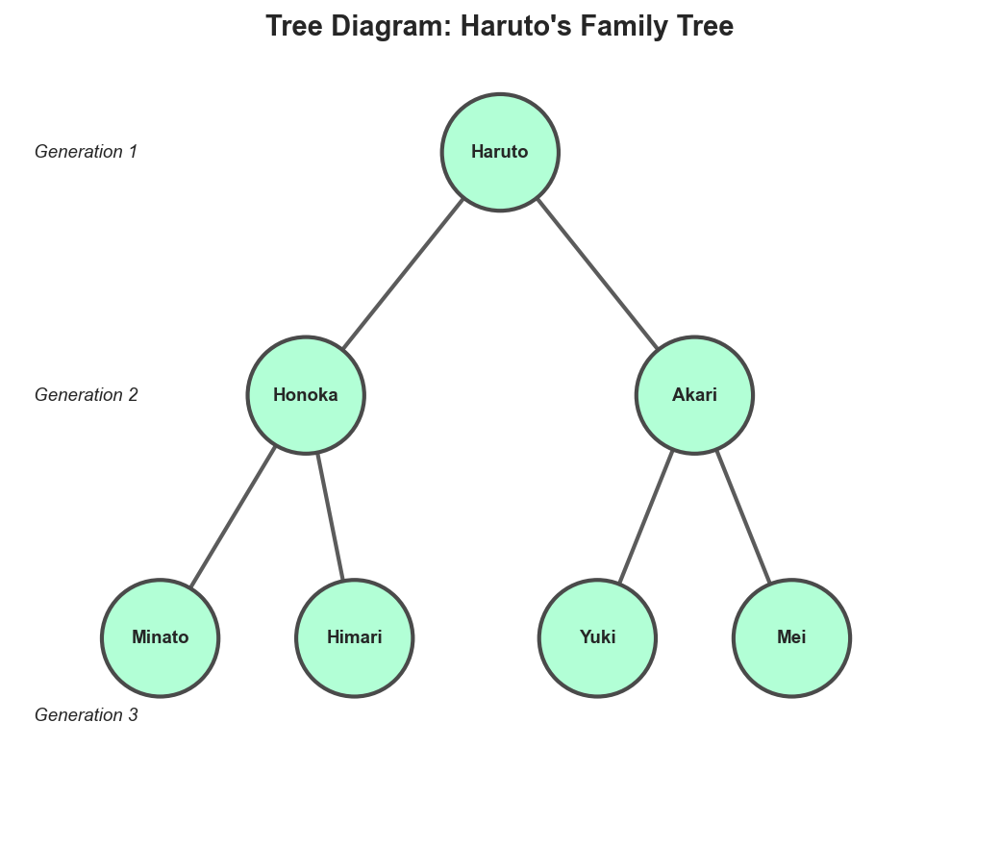

---

#### Flowcharts

In a **flowchart**, each node stands for a step in a process. Arrows direct you from each step to the next. An arrow pointing back to an earlier step tells you to repeat that step. A flowchart usually has at least three types of nodes:
- **Process nodes** stand for actions to take and are usually rectangles
- **Decision nodes** show questions to answer and are usually diamond shaped. At least two labeled arrows lead from each decision node to show how choosing the next step depends on how you answer the question
- **Terminal nodes** show the start or end of the process and are usually oval

**Example:**

> The flowchart below shows a simple process for getting cereal from a store. The top oval shows the first step, going to the store. The arrow below it then takes us to a process node saying to look for a cereal we like. For the third step, we reach a decision node asking us whether we found the cereal we wanted. If we did, we follow the node's "Yes" arrow to another process node telling us to buy the cereal we found, then move on to the bottom terminal node telling us to go home. Otherwise, we follow the node's "No" arrow to a second decision node asking whether the store offers other good cereal choices. If it doesn't, we follow another "No" arrow telling us to give up and go home. But if the store does offer other good cereal choices, we follow a "Yes" arrow taking us back to the "look for a cereal you like" step to peruse the choices again. We repeat the loop until we either find a cereal we want to buy or decide the store has no more good cereal choices. Since the store won't have infinitely many cereals to consider, we eventually end at the bottom terminal node and go home.

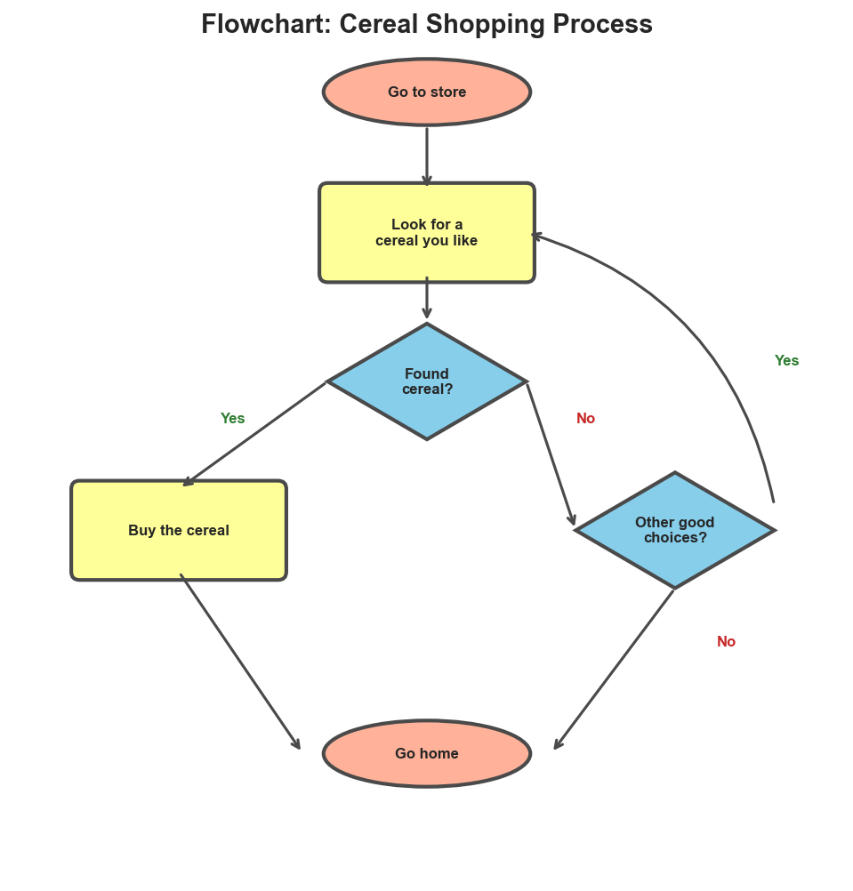

---

### Quantitative Charts

Here we discuss a few common types of charts that normally show quantitative data. The GMAT may also use rarer types this book doesn't discuss. To understand any type of quantitative chart, study the description and any labels to find out what cases and variables are shown, and how. Also notice any **axes**, these show the measurement scales used. Some quantitative charts have no axes, while others have one, two, or, rarely, three or more. For each axis, notice whether it shows 0 and any negative values, or whether it starts above 0. Study the numbers on the axes and note any named units the numbers stand for. You must read the axes correctly to read the data shown.

**Example:**

> In the chart below, labels say the scale on the left is for the temperature data, and the scale on the right is for the precipitation data. The bottom axis shows four months of the year, spaced three months apart. The chart's title tells us each data point gives the average temperature or precipitation in City X during a given month. This implies that the temperatures and precipitations shown are averages over many years. Suppose we're asked to find the average temperature and precipitation in City X in April. To do this, we don't have to calculate averages of any of the values shown. Those values are already averages. So, to find the average temperature for April, we simply read the April temperature data point by noting it's slightly lower than the 15 on the temperature scale at the left. Likewise, to find the average precipitation for April, we read the April precipitation data point by noticing it's about as high as the 8 on the precipitation scale on the right. This means the chart says that in April, the average temperature is about 14° Celsius and the average precipitation about 8 centimeters. Since the question is only about April, the data shown for January, July, and October are irrelevant.

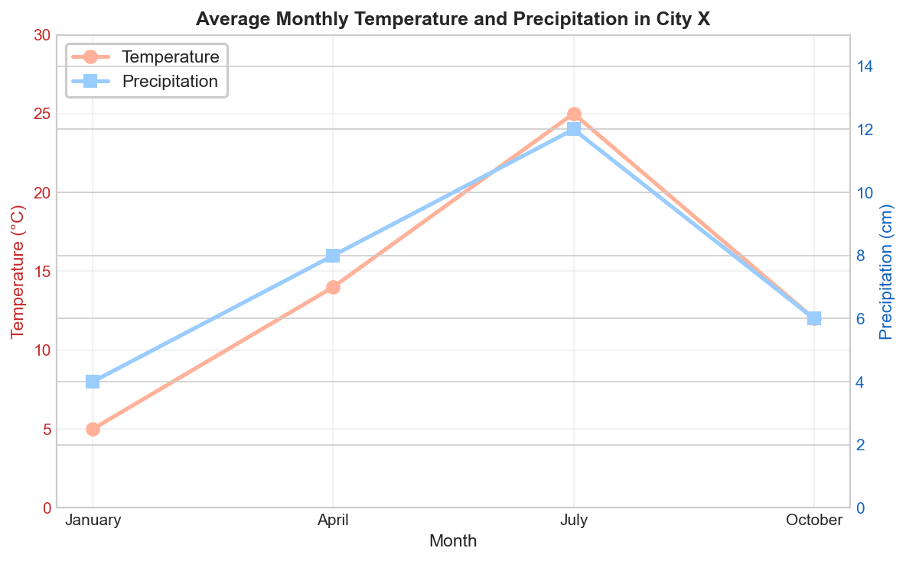

---

#### Pie Charts

A **pie chart** has a circle divided into sections like pie slices. The sections make up the whole circle without overlapping. They stand for parts that together make up some whole amount. Usually, each section is sized in proportion to the part it stands for, and labeled with that part's fraction, or percent, of the whole amount. You can use these fractions, or percents, in calculations.

**Example:**

> In the pie chart below, the sections are sized in proportion to their percent amounts. These percents add up to 100%. Suppose we're told that Al's weekly net salary is $350 and asked how many of the categories shown each individually took at least $80 of that $350. To answer, first we find that $80/$350 is about 23%, which means $80 or more of Al's salary went to a category, if and only if, at least 23% went to that category. So, the graph shows exactly two categories that each took at least $80 of Al's salary: the category Savings took 25% of his salary and Rent and Utilities took 30%.

**DISTRIBUTION OF AL'S WEEKLY NET SALARY**

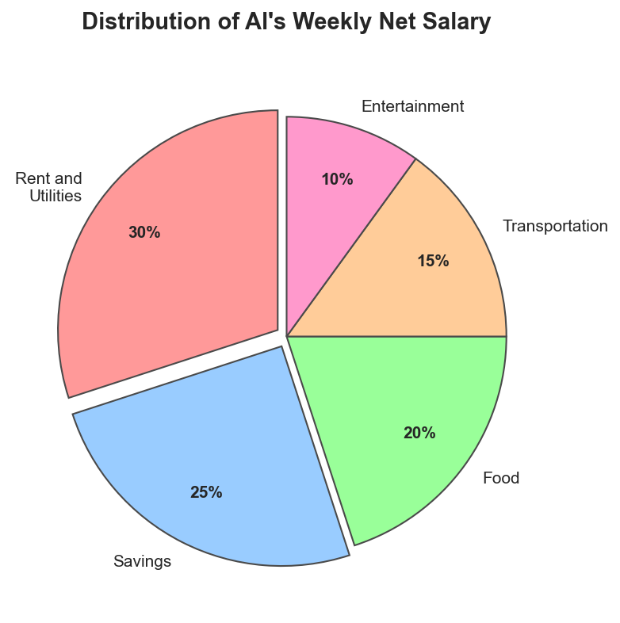

---

#### Bar Charts

A **bar chart** has a series of vertical or horizontal bars standing for a set of cases. A simple bar chart has only one quantitative variable. The bars' different heights or lengths show that variable's values for different cases.

A **grouped bar chart** may have more than one quantitative variable. Its bars are grouped together. Each group either shows the values of different variables for one case, or else the values of related cases for one variable.

And in a **stacked bar chart**, segments are stacked into bars. Each segment inside a bar stands for part of an amount, and the whole bar stands for the whole amount.

**Example:**

> The bar chart below is both grouped and stacked. Each pair of grouped bars shows population figures for one of three towns. In each pair, the bar on the left shows the town's population in 2010, and the bar on the right shows the town's population in 2020. Inside each bar, the lower segment shows how many people in the town were under age 30, and the upper segment shows how many were age 30 or older. For example, the chart's fifth bar shows that in 2010 Ceburg's population was around 2,000, including about 1,100 people under 30 and 900 people 30 or older. And the chart's sixth bar shows that by 2020, Ceburg's population had grown to around 2,400, including about 1,200 people under 30 and 1,200 people 30 or older. By reading the chart this way to find the amounts shown, we can also estimate various other amounts, like the three towns' combined total number of residents 30 or older in 2020.

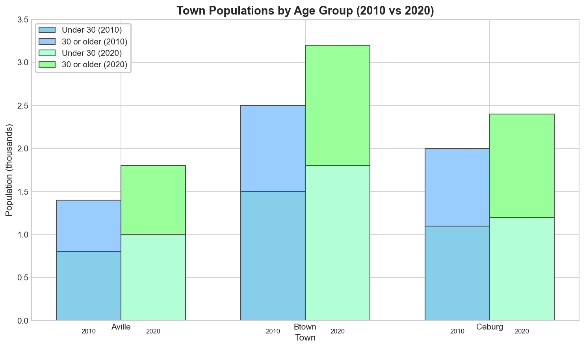

---

#### Histograms

A **histogram** looks like a vertical bar chart but works differently. In a histogram, each bar stands for a range of values that the same quantitative variable can take. These ranges don't overlap. Together they usually include every value the variable can take, or at least every value it does take in some population. The bars are in order left to right, from the one standing for the lowest range of values to the one standing for the highest range. Each bar's height shows the number or proportion of times the variable's value is in the range the bar stands for. A histogram makes it easy to see how the values are distributed.

**Example:**

> The histogram below shows the measured weights of 31 gerbils. Each bar's height shows how many gerbils were in a specific weight range. For example, the bar farthest left says 3 gerbils each weighed from 60 to 65 grams. The histogram doesn't show any individual gerbil's weight. However, it does give us some statistical information. For example, by adding the numbers of gerbils in the different weight ranges, we can tell that the 16th-heaviest of the 31 gerbils weighed between 75 and 80 grams. This means the gerbils' median weight was in that range. The histogram also shows that the gerbils mainly weighed between 70 and 85 grams apiece, though several weighed less or more.

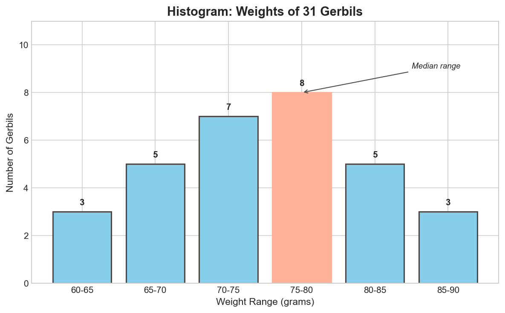

---

#### Line Charts

A **line chart** often shows how the values of one or more quantitative variables change over time. Typically, the horizontal axis has the time scale, and the vertical axis has one or more scales for the variable or variables. One or more lines connect the data points. Different lines may stand either for different variables or for a single variable applied to different cases. Line charts make it easy to see trends and correlations.

Some line charts show probability distributions instead of changes over time, as we'll see in section 1.3.1 below.

**Examples:**

> (i) In section 1.2.3.A above, the chart of average monthly temperatures and precipitations is a line chart whose two variables have two separate scales, one on the left and one on the right.
>
> (ii) The line chart below shows how many toasters of each of three different brands were sold each year from 2017 to 2022. Each sloping line shows how sales changed for one of the three brands during that period. The legend on the bottom says which line stands for which toaster brand. All three lines use the scale on the left, whose numbers stand for thousands of units sold annually. The chart shows that over the six years, annual sales of Crispo toasters increased dramatically, while annual sales of Brownita toasters declined to almost zero, and annual sales of Toastador toasters fluctuated.

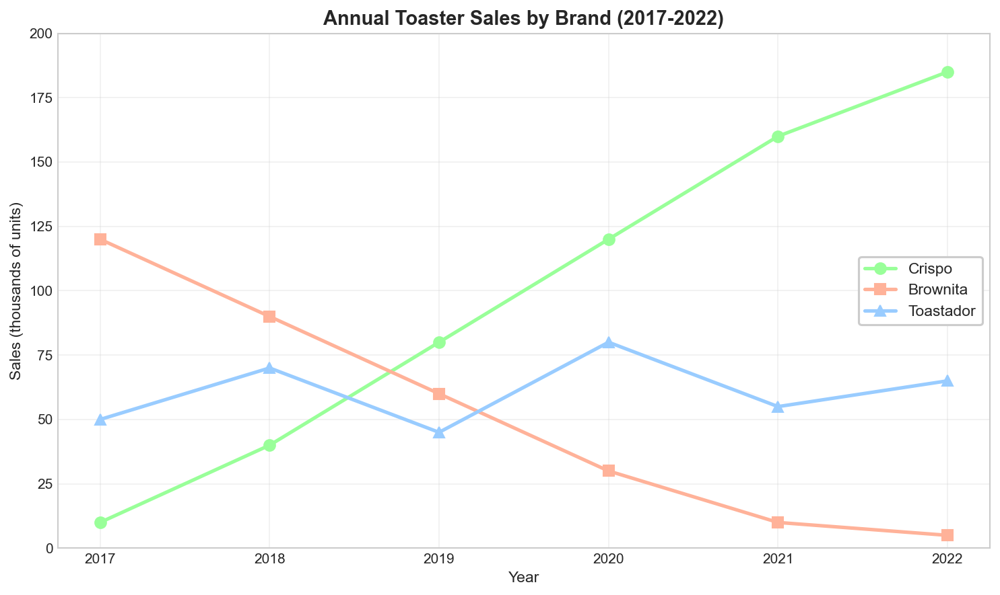

---

#### Scatterplots

A **scatterplot** has at least two quantitative variables, one on each axis. For each case in the data, a dot's position shows the variables' values. No lines connect the scattered dots, but a straight or curved line through the scatterplot may show an overall trend in the data. Sometimes the dots have a few different shapes or colors to show they stand for cases in different categories. And in scatterplots called **bubble charts**, the dots have different sizes standing for values of a third variable.

Scatterplots are useful for showing correlations. They also show how much individual cases fit an overall correlation or deviate from it.

**Example:**

> The scatterplot below shows measured widths and lengths of leaves on two plants. Each dot stands for one leaf. The dot's position stands for the leaf's width and length in centimeters, as the scatterplot's two axes show. The legend says how one set of dots stand for leaves on the first plant, and another set for leaves on the second. The scatterplot shows that in general, the longer leaves tend to be wider, and vice versa. It also shows how leaves on the second plant tend to be somewhat longer and wider than those on the first, with some exceptions.

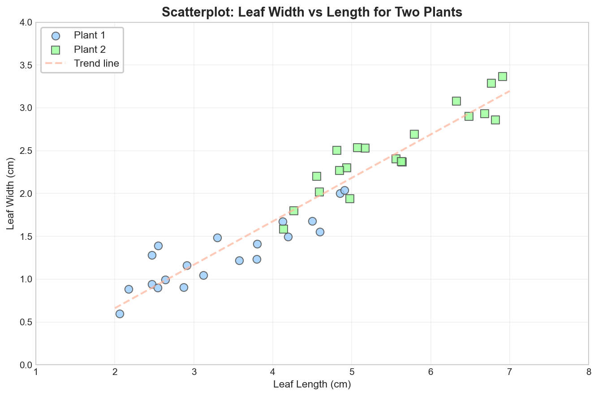

---

## Data Patterns

### Distributions

A **data distribution** is a pattern in how often different values appear in data. How data in a sample is distributed can tell you how likely different values are to appear in the same population outside the sample.

A distribution is **uniform** when each value occurs more or less equally often. It's less uniform when the differences between how frequently the values occur are greater. The more uniform a distribution is for a sample, the better it supports the conclusion that the distribution for other cases in the population is likewise uniform.

**Example:**

> Suppose the six faces on a die are numbered 1 to 6. And suppose that when rolled sixty times, the die comes up 1 eleven times, 2 nine times, 3 ten times, 4 eleven times, 5 ten times, and 6 nine times. This isn't a perfectly uniform distribution, because the six values 1 to 6 didn't occur exactly ten times apiece. However, because each value did occur between nine and eleven times, the distribution is fairly uniform. This suggests that each of the six values is about equally likely to occur again when the die is rolled, and that the distribution of the values for future rolls will stay fairly uniform.

---

#### Normal and Skewed Distributions

A variable's values are often distributed unevenly. Sometimes one central value occurs most often, with other values occurring less often the farther they are from the central value. When this type of distribution is **normal**, each value below the central value occurs just as often as the value equally far above the central value. For a perfectly normal distribution, the central value is the mean, the median, and the mode. When plotted on a chart, a normal distribution is bell shaped, with a central hump tapering off equally into tails on both sides. But a distribution with a larger tail on one side of the hump than the other is not normal but **skewed**. For a skewed distribution, the mean is often farther out on the larger tail than the median is.

**Example:**

> The two charts below show distributions of lengths for two beetle species. The chart on the left shows that the lengths of species A beetles have roughly a normal distribution. The central hump is symmetrical, with equal tails on both sides. By looking at the chart, we can tell that the mode, the median, and the mean of the lengths for species A are all around 5 millimeters. However, the chart on the right shows that the lengths of species B beetles have a skewed distribution. The tail on the right side of the hump is larger than the tail on the left side, which means more beetles of species B have lengths above the mode than below it. As a result, the median length for species B is above the mode, and the mean is above the median.

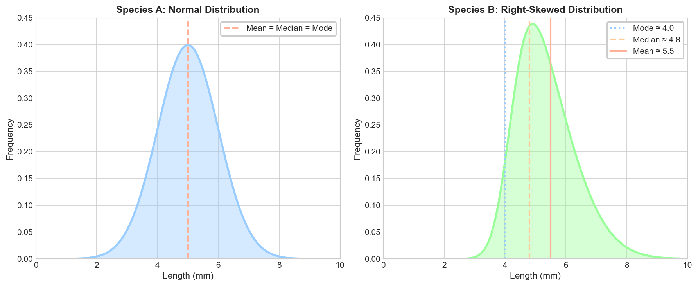

---

#### Clustered Distributions and Standard Deviation

The more tightly clustered a distribution is around a central value, the higher and narrower the hump is, and the smaller the tails are. A more tightly clustered distribution also has a smaller **standard deviation**. The more tightly clustered a distribution is for an observed sample, the more likely a new case from the population outside that sample is to have a value near the distribution's central value.

**Example:**

> For each of three tasks, the chart below shows how frequently it takes workers different lengths of time in minutes to complete that task. Even though the bottom axis shows times from 1 to 5 minutes, it doesn't stand for a single period starting at 1 minute and ending at 5 minutes. Instead, it stands for a range of lengths of task completion times.
>
> Notice how the chart uses smooth curves to show the frequencies of different completion times. That suggests it shows trends idealized from the observed data points, which could be shown more precisely as separate dots or bars.
>
> For each task, the distribution of completion times is uniform, with a mode, median, and mean of 3 minutes. But the completion times are most tightly clustered around 3 minutes for Task A, and least tightly clustered for Task C. That means the standard deviation of the completion times is lowest for Task A and highest for Task C. It also means the probability is higher that an individual worker will take close to 3 minutes to complete Task A than to complete Task C. A worker's completion time for Task C is less predictable and likely to be farther from 3 minutes. So, the chart gives stronger evidence for the conclusion that finishing Task A will take a worker between 2 and 4 minutes than for the conclusion that finishing Task C will take that worker between 2 and 4 minutes.

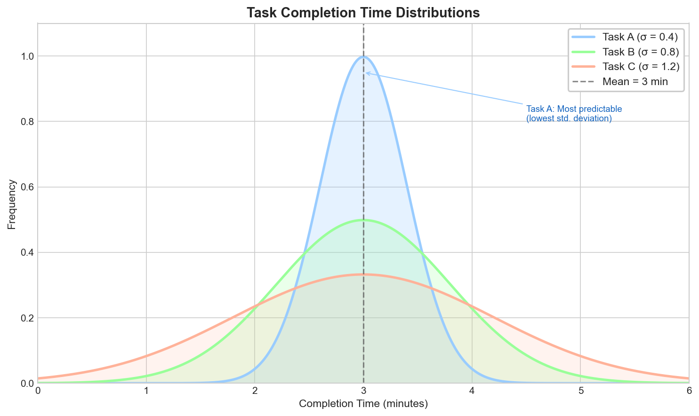

Data distributions take many other shapes too. Some have two or more humps, and others have random variations in frequency among adjacent values. In general, the less the values in a sample cluster around one central hump, the larger the standard deviation is, and the less predictable the values are for cases in the population outside the observed sample.

---

### Trends and Correlations

Charts often show trends over time. They may show that a variable's values increase, decrease, fluctuate, or change in cycles. They may also show values of different plotted variables changing the same ways or opposite ways.

Other things equal, an observed trend over a period is evidence that the same trend extends at least slightly before and after that period. This evidence is stronger the longer the observed trend has lasted and the more varied the conditions it's lasted through. Generalizing from a longer observed period with more varied conditions is like generalizing from a larger sample. But the odds increase of other factors disrupting the observed trend at times more distant from the observed period, and in situations whose conditions differ more from those observed.

**Example:**

> The line chart in section 1.2.3.E above shows that annual sales of Crispo toasters rose from fewer than 10,000 in 2017 to over 180,000 in 2022. If this trend continues another year, even more than 180,000 Crispo toasters will be sold in 2023. However, many factors might disrupt Crispo's surging popularity. For example, another company might start making better or cheaper toasters, drawing consumers away from Crispo toasters. Or broader social, economic, or technological changes might reduce demand for toasters altogether. The more years pass outside the observed period of 2017 through 2022, the more likely such disruptions become. So, the observed trend gives stronger evidence that annual Crispo toaster sales will be over 180,000 in 2023 than it gives that they'll still be over 180,000 in 2050.

---

#### Positive and Negative Correlations

Two quantitative or ordinal variables are **positively correlated** if they both tend to be higher in the same cases. They're **negatively correlated** if one tends to be higher in cases where the other is lower.

**Examples:**

> (i) If warmer days tend to be rainier in a certain region, then temperature and precipitation are positively correlated there.
>
> (ii) But if warmer days tend to be drier in a different region, then temperature and precipitation are negatively correlated in that second region.

On a line chart, the lines standing for positively correlated variables tend to slope up or down together. The more consistently the slopes match, the stronger the positive correlation. But when two variables are negatively correlated, the line standing for one tends to slope up where the other slopes down, and vice versa. The more consistently the lines slope in opposite directions, the stronger the negative correlation.

**Examples:**

> (i) The chart in section 1.2.3.A shows a positive correlation between average monthly temperature and precipitation in City X. The temperature and precipitation lines both slope up together from January through July, and then slope down together.
>
> (ii) The chart in section 1.2.3.E shows a negative correlation between annual sales of Crispo toasters and annual sales of Brownita toasters. Throughout this chart, the line standing for Crispo toaster sales slopes up and the line standing for Brownita toaster sales slopes down. However, the chart shows no clear positive or negative correlation of Crispo or Brownita toaster sales with Toastador toaster sales. The line standing for Toastador toaster sales fluctuates, sometimes sloping up and sometimes down. It shows no consistent trend relative to the other two lines. So, the chart doesn't clearly support a prediction that in future years Toastador sales will increase or decrease as Crispo or Brownita sales do the same or the opposite.

---

#### Correlations in Scatterplots

When a scatterplot shows a positive correlation, the dots tend to cluster around a line that slopes up. When it shows a negative correlation, they tend to cluster around a line that slopes down. The stronger the correlation, the more tightly the dots cluster around the sloped line. If the dots spread farther away from the sloped line, or cluster around a line with a less consistent slope, the correlation is weaker or non-existent.

**Example:**

> The scatterplot in section 1.2.3.F shows leaf width as positively correlated with leaf length for both plants. The dots mostly cluster around a line sloping up, which means wider leaves tend to be longer and vice versa. Thus, the scatterplot supports a prediction that if another leaf on one of the plants is measured, it too will probably be wider if it's longer. However, the correlation in the scatterplot isn't perfect. For example, the dot farthest to the right is lower than each of about a dozen dots to its left. That dot farthest to the right stands for a leaf that's both longer and thinner than any of the leaves those other dozen dots stand for. This inconsistency in the correlation somewhat weakens the scatterplot's support for the prediction that another leaf measured on one of the plants will be wider if it's longer.

---

#### Nominal Variable Associations

Values of a nominal variable may also be associated with higher or lower values of an ordinal or quantitative variable. Different values of two nominal variables can also be associated with each other.

**Examples:**

> (i) Species is a nominal variable. Individuals of some species tend to weigh more than individuals of other species, so different values of the nominal variable species are associated with higher or lower values of the quantitative variable weight.
>
> (ii) As another example, university students majoring in certain subjects like physics are more likely to take certain courses like statistics than university students majoring in other subjects like theater are, even though university major and enrollment in a course are both nominal variables.

An association involving a nominal variable like species isn't a positive or negative correlation because nominal variables aren't ordered; one species isn't greater or less than another. Still, these nominal associations can be shown in qualitative charts and tables and can support predictions. Knowing an animal's species gives you some evidence about roughly how much it will likely weigh and knowing a university student's major gives you some evidence about what courses they're most likely to take.
